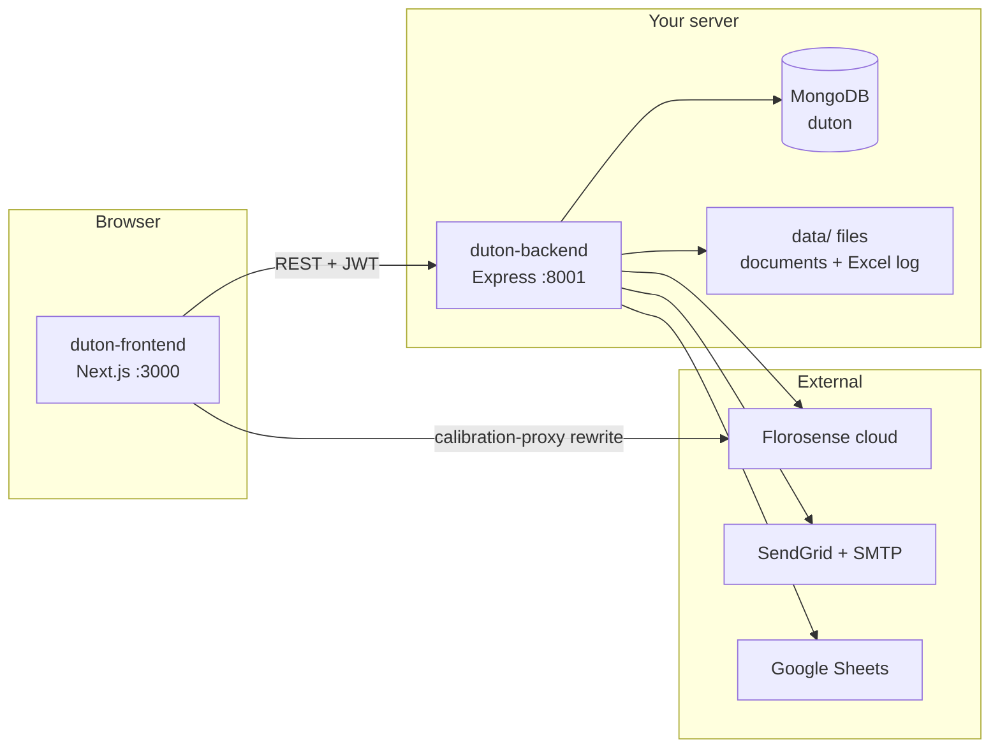
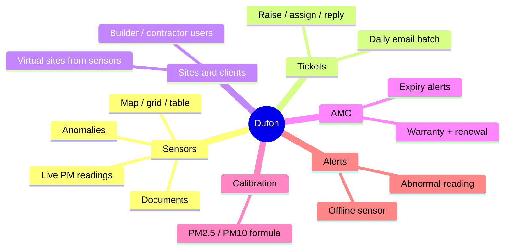
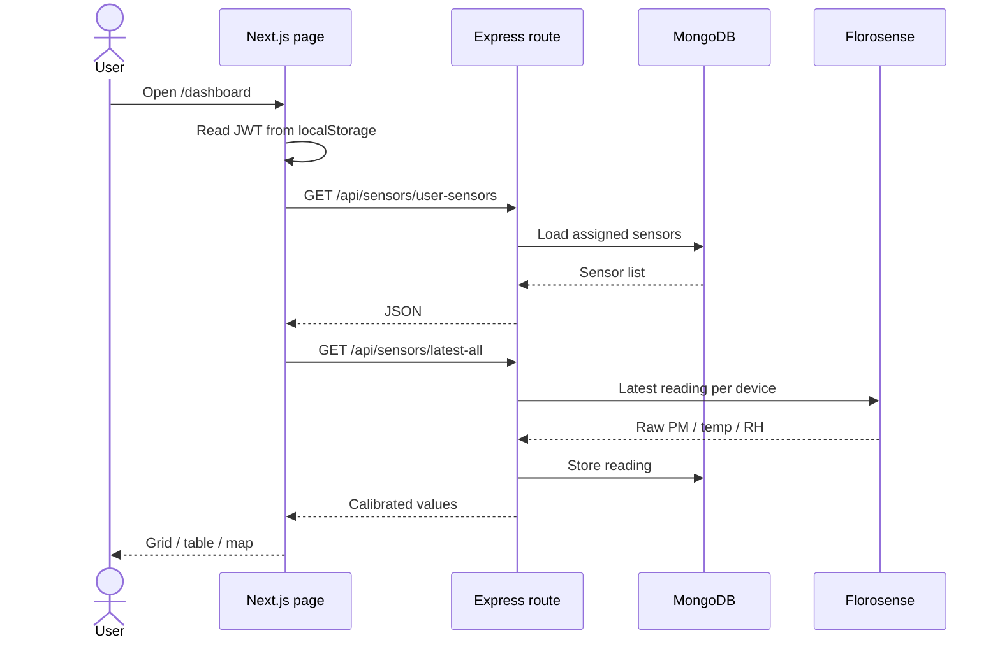

# System overview

How `duton-frontend` and `duton-backend` fit together.

## Two folders, one product

| Folder | Stack | Default URL | Job |
|--------|-------|-------------|-----|
| `duton-frontend` | Next.js 16, React 19, Tailwind 4, shadcn/ui | `http://localhost:3000` | Screens, maps, charts, forms |
| `duton-backend` | Express 4, native MongoDB driver, JWT | `http://127.0.0.1:8001` | Auth, CRUD, polling, emails, alerts |

The frontend does **not** talk to MongoDB. It calls backend HTTP APIs. In local/dev it usually uses `NEXT_PUBLIC_TICKET_API_URL` (or `http://localhost:8001/api`). Next.js also rewrites some `/api/*` paths to the Express server (see `duton-frontend/next.config.mjs`).

## Who uses it

| Role | Where they live | What they see |
|------|-----------------|---------------|
| `admin` | `admins` collection | Everything: sensors, sites, clients, alerts, AMC, calibration |
| `assignee` | `assignees` collection | Assigned tickets + all sensors (remarks, calibration) |
| `user` | `users` collection | Only sensors assigned to them |
| `builder` / `contractor` | `users` collection | Sensors on sites assigned to them; AMC banner |
| `guest` | magic-link token | One shared sensor, short-lived JWT |

Login is tried in this order on the login form: **admin** (username `admin`) → **assignee** → **user** → optional Duton `/auth/login` fallback.

## What the product does

## Data the backend keeps (MongoDB)

Most collections are created and used from `duton-backend/src/services/database.js`.

| Collection | Stores |
|------------|--------|
| `admins`, `assignees`, `users` | Login accounts (separate collections) |
| `sensors`, `sensor_readings` | Device metadata + stored samples |
| `user_sensors`, `user_sites` | Who can see which sensor / site |
| `support_tickets`, `ticket_replies` | Ticket center |
| `sites` | Rarely used — sites are mostly derived from `sensors.site_name` |
| `calibrations` | Admin calibration records |
| `amc_features`, `amc_audit_logs` | Warranty / AMC tracking |
| `alert_states`, `alert_logs` | Offline / abnormal alert state |
| `share_access_tokens` | Magic-link guest access |
| `sensor_documents` | File metadata (files sit on disk under `data/sensor_documents/`) |
| `admin_otps` | Password-reset OTPs |

## Background work (no browser needed)

Started from `server.js` after MongoDB connects:

| Job | Interval | File |
|-----|----------|------|
| Sensor reading collector | every 10 min | `services/sensorReadingCollector.js` |
| Ticket assignment emails | 10:00 IST | `services/ticketAssignmentScheduler.js` |
| Ticket reminders | 18:00 IST | same scheduler |
| Alert monitor | every 15 min | `services/alertMonitor.js` |

## Request path (happy path)

Next: [Frontend guide](02-frontend-guide.md) — where the UI starts and how folders map to screens.
