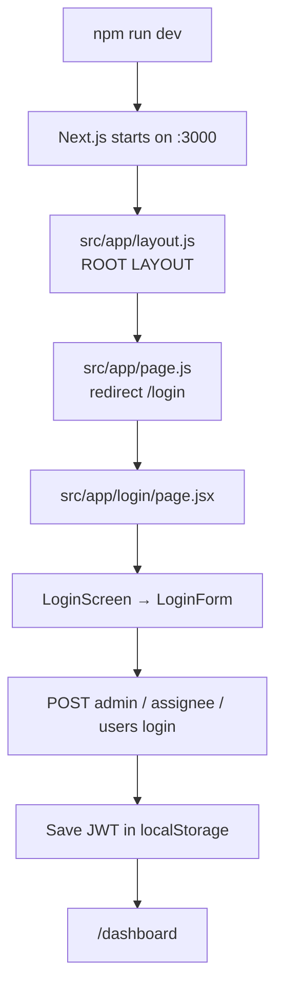
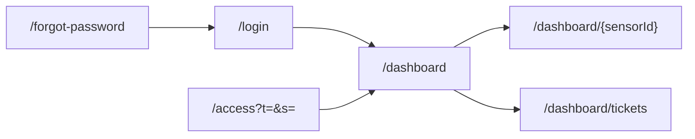
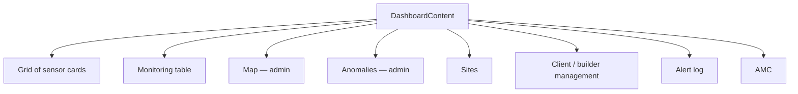
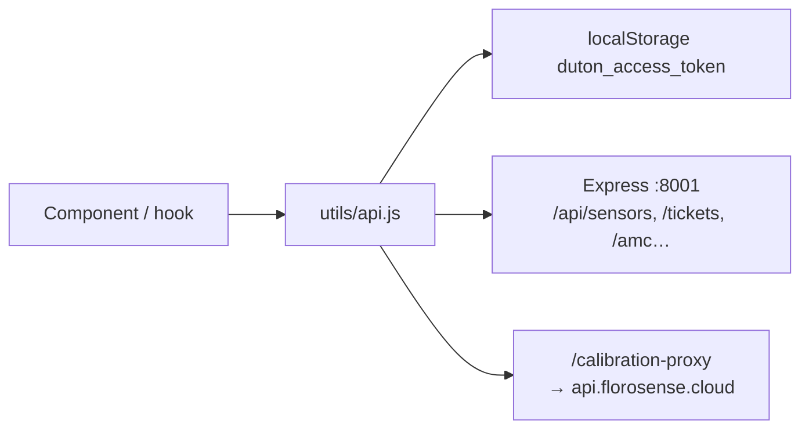

# Frontend guide (`duton-frontend`)

Next.js App Router dashboard. Almost every screen is a **client component** (`"use client"`). There is **no** `middleware.js` and **no** React Context for auth — the JWT lives in `localStorage`.

## Entry point



| File | Role |
|------|------|
| `src/app/layout.js` | **App entry wrapper.** Font, dark theme, toaster. Every page renders inside this. |
| `src/app/page.js` | **URL `/`.** Immediately redirects to `/login`. |
| `src/app/login/page.jsx` | Login screen. |
| `src/components/auth/login-form.jsx` | Actual login logic and token storage. |
| `next.config.mjs` | Proxies `/api/*` to Express and `/calibration-proxy/*` to Florosense. |

After login, `getClientUserContext()` in `src/lib/user-context.js` reads `duton_access_token` and `duton_user_type` to decide admin / assignee / builder / restricted user.

## Folder map

```
duton-frontend/src/
├── app/                         ← pages (URLs)
│   ├── layout.js                ★ entry wrapper
│   ├── page.js                  ★ /  →  /login
│   ├── login/page.jsx
│   ├── forgot-password/page.jsx
│   ├── access/page.jsx          magic-link guest
│   ├── dashboard/
│   │   ├── page.jsx             sensor hub
│   │   ├── [monitorid]/page.jsx one sensor
│   │   └── tickets/page.jsx     ticket center
│   └── api/proxy/historical-download/route.js
├── components/
│   ├── auth/                    login UI
│   ├── dashboard/               hub, maps, AMC, sites, tickets widgets
│   ├── monitoring/              per-sensor live page
│   ├── layout/                  video background
│   └── ui/                      shadcn buttons, dialogs, tables
├── hooks/                       tickets + sensor lists
├── lib/                         roles, ticket constants, date helpers
├── theme/theme.js               next-themes
├── utils/api.js                 ★ all HTTP calls used by the app
└── utils/calibration.js         PM correction formula on the client
```

`src/utils/api/*.js` (auth, sensors, tickets, …) exist as split copies. **The running app imports `@/utils/api` (the single `api.js` file), not those split files.**

## Routes (what the user opens)



| URL | File | What it shows |
|-----|------|----------------|
| `/` | `app/page.js` | Redirect to login |
| `/login` | `app/login/page.jsx` | Username / password |
| `/forgot-password` | `app/forgot-password/page.jsx` | OTP reset (admin email flow) |
| `/access` | `app/access/page.jsx` | Validates magic link, then dashboard |
| `/dashboard` | `app/dashboard/page.jsx` | Sensor picker + admin tabs |
| `/dashboard/[monitorid]` | `app/dashboard/[monitorid]/page.jsx` | Live monitoring for one device |
| `/dashboard/tickets` | `app/dashboard/tickets/page.jsx` | Full ticket center |

## `/dashboard` — the hub

`dashboard/page.jsx` composes:

1. `VideoBackground`
2. `AmcAlertBanner` (non-admin)
3. `DashboardHeader` (logo, theme, raise ticket, logout)
4. `DashboardContent` — **main orchestrator** (fetch sensors, views, admin tabs)
5. Admin-only calibration button → `CalibrationSetupDialog`

Inside `DashboardContent`, views and admin tabs are hardcoded:



Clicking a sensor card goes to `/dashboard/{sensor.id}`.

## `/dashboard/[monitorid]` — one sensor

`MonitoringDashboard` pulls sections together:

| Component | Shows |
|-----------|--------|
| `MonitoringHeader` | Title / SPOC |
| `RealTimeDataCards` | PM2.5, PM10, temp, humidity |
| `PMTrendAnalysis` | Recharts history |
| `SiteInformation` / `StationLocation` | Site + Leaflet map |
| `DownloadHistoricalData` | Excel / CSV export |
| `DocumentsSection` | Upload / download files |
| `DiagnosticsSection` | Device diagnostics |
| `SPOCDetails` | Contact card |

Readings poll about every **30 seconds**. Calibration from `utils/calibration.js` is applied on the client: `corrected = k0 + k1 * raw + random variation`.

## How the UI calls the API

Almost every fetch goes through `src/utils/api.js`.



Auth headers: `Authorization: Bearer <token>`.

Important localStorage keys:

| Key | Meaning |
|-----|---------|
| `duton_access_token` | JWT |
| `duton_user_type` | `admin` / `assignee` / `user` / `builder` / `contractor` / `guest` |
| `duton_username` | Display name |
| `duton_sensor_id` | Guest magic-link sensor |
| `duton_pm_calibration_{id}` | Cached calibration |

There is **no server-side route guard**. Each page that cares about login checks `localStorage` itself (for example the tickets page redirects to `/login` if the token is missing).

## State — keep it simple

- No Redux / Zustand
- `useState` + `useEffect` per screen
- Module cache in `use-ticket-sensors.js` (60s)
- Custom events: `duton_support_tickets_refresh`, `calibrationSaved`

## UI kit

shadcn/ui (New York, stone) under `src/components/ui/`. Theme default is **dark** (`src/app/layout.js` + `src/theme/theme.js`).

Next: [Backend guide](03-backend-guide.md).
