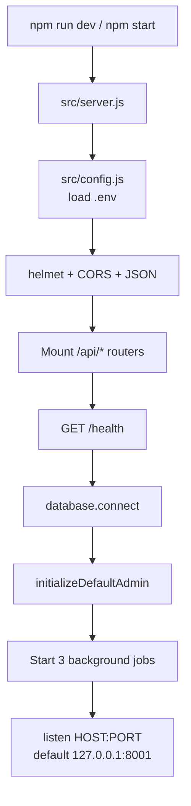
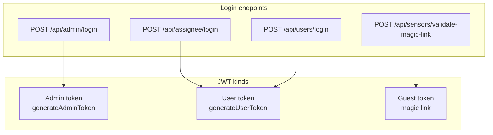

# Backend guide (`duton-backend`)

Express 4 API (ES modules). Native MongoDB driver — **not** Mongoose. Model files are helpers/validators, not an ORM.

## Entry point



| File | Role |
|------|------|
| `src/server.js` | **Process entry.** Creates Express, mounts routes, connects DB, starts jobs. |
| `src/config.js` | **Config entry.** Reads `.env` next to the backend folder. Requires `NEW_DB_URL`, Florosense URL + key. |
| `src/services/database.js` | All MongoDB helpers used by existing features. |
| `src/middleware/auth.js` | JWT create / verify (`verifyAdminToken`, `verifyUserToken`, …). |
| `src/middleware/apiKey.js` | `X-API-Key` for machine access to some sensor routes. |

`package.json` `"main"` is `src/server.js`. PM2 uses `ecosystem.config.js`.

## Folder map

```
duton-backend/
├── src/
│   ├── server.js              ★ entry
│   ├── config.js              ★ env
│   ├── routes/                URL → handler
│   │   ├── tickets.js
│   │   ├── admin.js
│   │   ├── users.js
│   │   ├── sensors.js
│   │   ├── assignee.js
│   │   ├── sites.js
│   │   ├── calibration.js
│   │   ├── alerts.js
│   │   └── amc.js
│   ├── controllers/           request/response logic
│   │   ├── userController.js
│   │   ├── siteController.js
│   │   ├── sensorController.js
│   │   └── calibrationController.js
│   ├── services/              DB + jobs + integrations
│   ├── models/                enums / validation helpers
│   ├── middleware/            JWT + API key
│   └── utils/                 email + calibration math
├── scripts/                   create-admin, migrate, set password
└── .env.example
```

Typical layering:

```
Route file  →  Controller (or inline handler)  →  database.js / a service  →  MongoDB
```

Some routers (`tickets.js`, `admin.js`, `alerts.js`, `assignee.js`) keep handlers **inline**. Others (`users`, `sensors`, `sites`, `calibration`, `amc`) call controllers or services.

## Mounted APIs

Wired in `server.js`:

| Prefix | File | Auth (typical) |
|--------|------|----------------|
| `/api/tickets` | `routes/tickets.js` | List needs user JWT; create/get/patch often open |
| `/api/admin` | `routes/admin.js` | Admin login + client/sensor admin CRUD |
| `/api/users` | `routes/users.js` | User login + admin user CRUD |
| `/api/sensors` | `routes/sensors.js` | User JWT, or `X-API-Key` on a few GETs |
| `/api/assignee` | `routes/assignee.js` | Admin create; public login |
| `/api/sites` | `routes/sites.js` | Admin / user JWT |
| `/api/admin/calibration` | `routes/calibration.js` | User JWT read, admin write |
| `/api/alerts` | `routes/alerts.js` | Admin |
| `/api/amc` | `routes/amc.js` | User JWT for my-alert; admin for the rest |
| `/health` | `server.js` | None — `{ status: "ok" }` |

## Auth in one picture



Header: `Authorization: Bearer <token>`. Secret: `JWT_SECRET` (or `TICKET_JWT_SECRET`). Default expiry `24h`.

## Feature logic (short)

**Tickets**  
Active-ticket limits for non-admins (max 4, one per sensor, one per issue type). Setting `assignee` on PATCH stores `pending_assignee` until the daily cron emails the batch.

**Sensors**  
Master docs in `sensors`. Latest endpoint also hits Florosense and writes `sensor_readings`. Anomalies: PM2.5/PM10 stuck for 24h.

**Sites**  
Mostly **virtual**: unique `site_name` values on sensors. `user_sites.site_id` is actually a site **name**.

**Calibration (three places)**  
1. `calibrations` collection — `/api/admin/calibration`  
2. Embedded `sensor.calibration` — `/api/sensors/:id/calibration`  
3. Florosense remote — applied when fetching latest / chart data  

**AMC**  
Warranty = installation + 1 year. AMC = renewal + 1 year. Alert window 90 days. Client banner: `GET /api/amc/my-alert`.

**Alerts**  
Offline: no reading for 24h. Abnormal: PM ≤ 0 or > 500 for 24h. Emails go to builder/contractor users on that site who have alerts enabled.

## External systems

| System | Used for |
|--------|----------|
| Florosense API | Latest readings, historical, remote calibration |
| SendGrid | OTP, magic link, assignee credentials |
| SMTP (e.g. Brevo) | Sensor alerts, ticket batch / reminder mail |
| Google Sheets | Site metadata CSV fetch |
| Disk `data/` | Uploaded sensor documents, assignment Excel log |

## Dead / unused (do not treat as entry points)

- `src/services/database/index.js` — old copy, **not imported**
- `proxyDownloadSensorData` in the sensor controller — **no route mounted**

Next: [Development guide](04-development-guide.md) — run it and follow one request.
