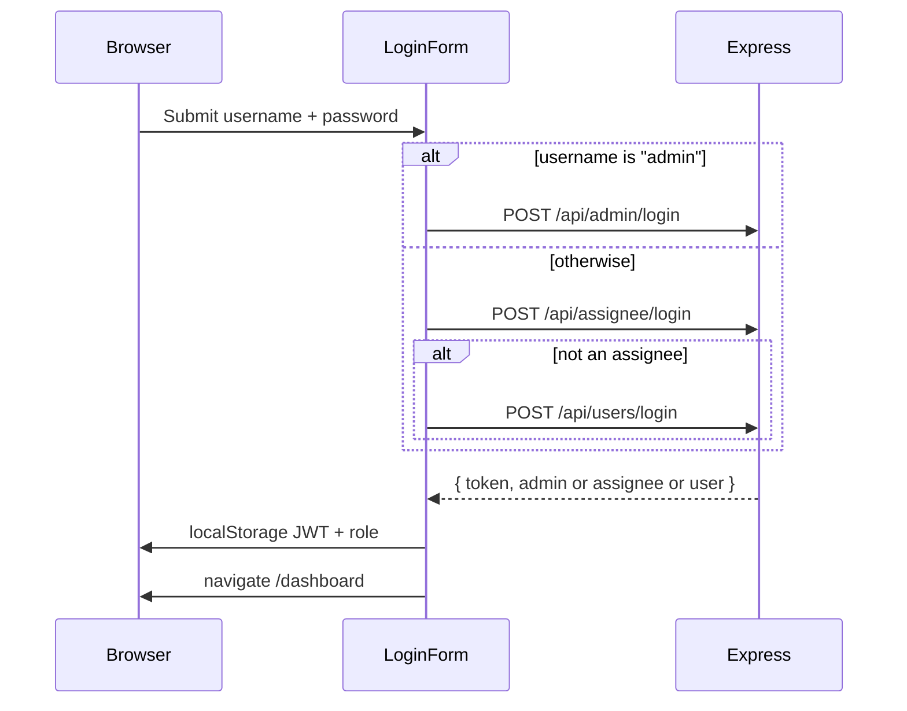
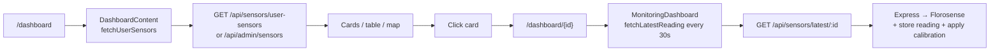
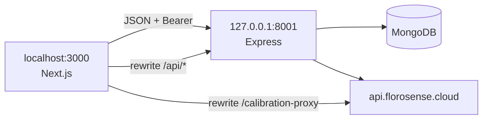

# Development guide

How to run both folders locally, what a typical request looks like, and where to put **new** code without rewriting old files.

## Prerequisites

- Node.js 18+
- MongoDB (connection string in `NEW_DB_URL`)
- Florosense base URL + API key (backend will not start without them)

## 1. Backend

```bash
cd duton-backend
cp .env.example .env
# Fill at least: NEW_DB_URL, JWT_SECRET, FLOROSENSE_BASE_URL, FLOROSENSE_API_KEY
npm install
npm run dev
```

Expect: `http://127.0.0.1:8001` and `GET /health` → `{ "status": "ok" }`.

Useful scripts:

| Command | What it does |
|---------|----------------|
| `npm run dev` | `node --watch src/server.js` |
| `npm start` | Production `node src/server.js` |
| `node scripts/create-admin.js` | Create default admin if none exists |
| `node scripts/set-admin-password.js` | Reset admin password |
| `node scripts/migrate.js` | Copy/merge MongoDB between URIs |

## 2. Frontend

```bash
cd duton-frontend
npm install
npm run dev
```

Expect: `http://localhost:3000` → redirects to `/login`.

Create a `.env.local` in `duton-frontend` when you need non-default URLs:

```env
NEXT_PUBLIC_TICKET_API_URL=http://localhost:8001/api
NEXT_PUBLIC_BACKEND_URL=http://localhost:8001
NEXT_PUBLIC_FLOROSENSE_API_KEY=
BACKEND_URL=http://localhost:8001
```

| Variable | Used by |
|----------|---------|
| `NEXT_PUBLIC_TICKET_API_URL` | Browser calls to Express (`utils/api.js`, login form) |
| `NEXT_PUBLIC_BACKEND_URL` | Forgot-password / fallback auth |
| `NEXT_PUBLIC_FLOROSENSE_API_KEY` | Calibration proxy + historical download |
| `BACKEND_URL` | `next.config.mjs` rewrites (required in **production** build) |

## How a login works (both folders)



Tokens are **not** cookies. Closing the tab keeps the session until expiry or logout (`DashboardHeader` clears localStorage).

## How opening a sensor works



## How tickets work

1. Header `SupportTicketActions` → `createSupportTicket` → `POST /api/tickets`
2. Ticket Center page `/dashboard/tickets` lists via `useSupportTickets` → `GET /api/tickets`
3. Admin PATCH may set `pending_assignee`
4. Cron at 10:00 IST emails assignees and writes `data/ticket-assignment-log.xlsx`

## Local ports



## Where to add a new feature (without rewriting old code)

Prefer **new files**. Touch existing files only to mount a router or add a nav tab.

### Backend

1. `src/routes/my-feature.js` — Express router  
2. `src/controllers/myFeatureController.js` — handlers  
3. `src/services/myFeatureService.js` — business logic  
4. New collection: `database.getDatabase().collection("my_feature")` (do not grow `database.js` unless you must)  
5. **One existing-file change:** in `server.js`

```js
import myFeatureRouter from "./routes/my-feature.js";
app.use("/api/my-feature", myFeatureRouter);
```

### Frontend

1. `src/app/dashboard/my-feature/page.jsx` — new URL, no middleware to update  
2. `src/components/my-feature/` — UI  
3. `src/utils/api/my-feature.js` — new HTTP helpers imported **from the new page** (leave the big `api.js` alone if you can)  
4. `src/hooks/use-my-feature.js` if you need shared fetch state  

If the feature must appear as a **tab on `/dashboard`**, that tab list lives in `dashboard-content.jsx` — that file would need a small addition. Header links live in `dashboard-header.jsx`.

## Mental model cheat sheet

| Question | Answer |
|----------|--------|
| What file starts the website? | `duton-frontend/src/app/layout.js` then `page.js` → `/login` |
| What file starts the API? | `duton-backend/src/server.js` |
| Where are URLs defined (UI)? | `duton-frontend/src/app/**/page.jsx` |
| Where are URLs defined (API)? | `duton-backend/src/routes/*.js` mounted in `server.js` |
| Where is MongoDB accessed? | `duton-backend/src/services/database.js` |
| Where does the UI call HTTP? | `duton-frontend/src/utils/api.js` |
| Where is the JWT stored? | Browser `localStorage` (`duton_access_token`) |
| Who supplies live PM numbers? | Florosense cloud, cached in `sensor_readings` |

Back to the [docs index](INDEX.md).
