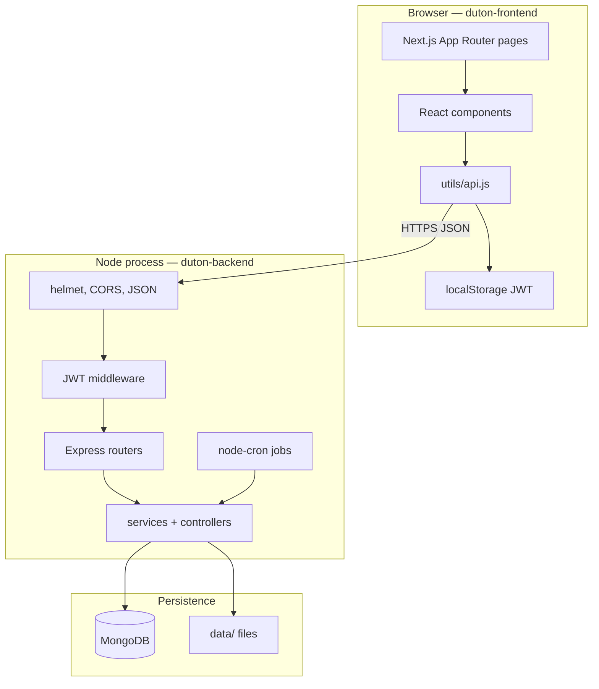
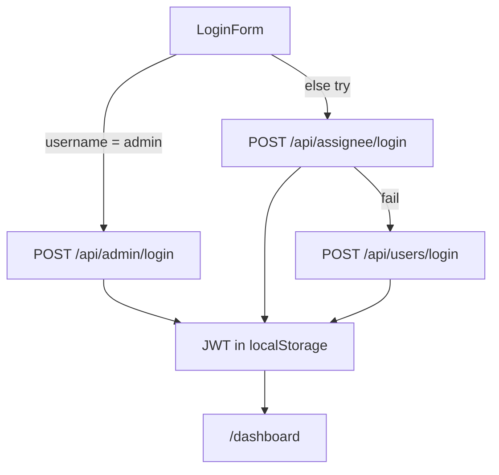
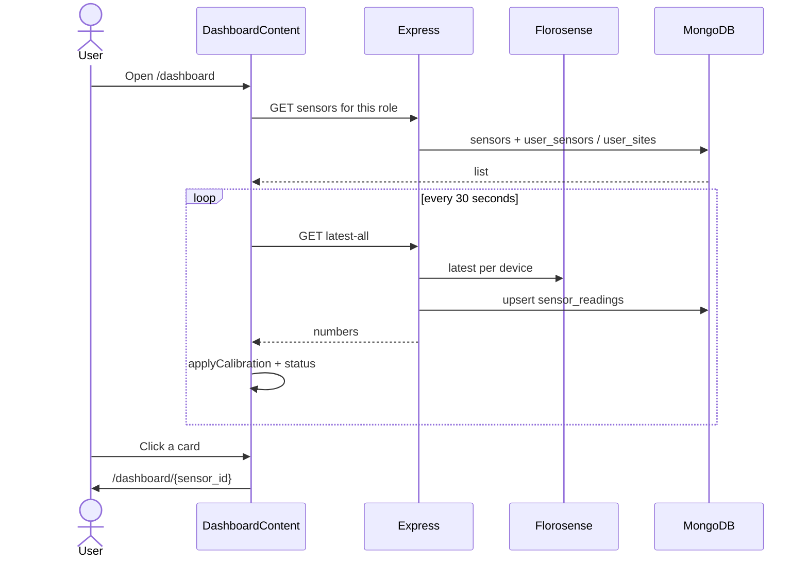

# Concepts, frameworks, folder structure, and workflows

This is the “why” document. Pair it with the overview and folder guides.

---

## 1. What this software is (the idea)

Duton is a **multi-tenant operations console** for air-quality monitors sold/installed as Florosense devices.

Each physical box reports **PM2.5**, **PM10**, **temperature**, and **humidity**. The cloud (Florosense) is the device network. Duton is the **business layer on top**: who may see which device, is the device online, is the number calibrated, is the AMC about to expire, and is there an open support ticket.

That split matters:

| Layer | Owner | Job |
|-------|--------|-----|
| Device / cloud | Florosense API | Raw telemetry |
| Application | Duton (`duton-backend` + `duton-frontend`) | Users, permissions, tickets, AMC, UI |
| Database | MongoDB (`duton`) | Accounts, sensor master data, stored readings, tickets |

The frontend **never** talks to MongoDB. The backend **never** renders HTML for the dashboard. They speak **REST + JSON + JWT**.

---

## 2. Architecture pattern

This is a classic **SPA (dashboard) + REST API** system.



**Important concepts used here (not libraries — ideas):**

| Concept | Meaning in Duton |
|---------|------------------|
| **Client–server** | Browser is dumb about data; Express is the source of truth |
| **REST** | Resources at URLs: `/api/sensors`, `/api/tickets`, HTTP verbs GET/POST/PUT/PATCH/DELETE |
| **Stateless auth** | Each request carries a JWT. Server does not keep a login session store |
| **Role-based access (RBAC)** | Same UI, different data: admin vs assignee vs builder vs user vs guest |
| **Polling** | Dashboard refreshes readings every 30s; backend collector every 10 min. No WebSockets |
| **Background jobs** | Emails and alerts run even if nobody has the website open |
| **Proxy / rewrite** | Next.js can forward `/api/*` to Express so the browser talks same-origin |
| **Calibration** | Displayed PM is not always the raw device number: `k0 + k1 * raw + variation` |

---

## 3. Frameworks and libraries — what each one actually does

### Frontend (`duton-frontend/package.json`)

| Technology | Why it is in this project |
|------------|---------------------------|
| **Next.js 16 (App Router)** | Routing by folder (`src/app/.../page.jsx`). Root `layout.js` wraps every screen. Also hosts one server route: historical download proxy. |
| **React 19** | UI as components. Almost every page is `"use client"` because the dashboard is interactive (poll, maps, dialogs). |
| **Tailwind CSS 4** | Utility classes for layout/theme. Tokens live in `src/app/globals.css`. |
| **shadcn/ui + Radix** | Copy-paste primitives in `src/components/ui/` (Dialog, Tabs, Table, Select). Config: `components.json` (New York / stone). |
| **next-themes** | Light/dark. Default **dark** in `layout.js`. Toggle in the header. |
| **Leaflet + react-leaflet** | Maps on sensor cards, all-sensors map, station location. Loaded with `dynamic(..., { ssr: false })` because Leaflet needs `window`. |
| **Recharts** | PM trend charts on the monitor page. |
| **ExcelJS + jsPDF** | Admin exports (sensor lists, AMC, tickets). |
| **sonner** | Toast notifications. |
| **lucide-react** | Icons. |
| **date-fns** | Date formatting. |
| **class-variance-authority + clsx + tailwind-merge** | Button variants and `cn()` class merging. |

Path alias: `@/` → `src/` (`jsconfig.json`). Import `@/utils/api` instead of long relative paths.

**What Next.js is *not* doing here:** there is no `middleware.js`, no server-side session, no global React Context for the user. Auth is **browser localStorage**. That is a design choice: simple, but every protected page must check the token itself.

### Backend (`duton-backend/package.json`)

| Technology | Why it is in this project |
|------------|---------------------------|
| **Node.js + Express 4** | HTTP server. `server.js` mounts routers. ES modules (`"type": "module"`). |
| **helmet** | Security headers. |
| **cors** | Browser on :3000 calling API on :8001. |
| **dotenv** | Load `duton-backend/.env` from `config.js`. |
| **mongodb (native driver)** | No Mongoose. Documents are plain objects. `database.js` is the data access layer. |
| **jsonwebtoken** | Sign/verify Bearer tokens (`middleware/auth.js`). Default 24h. |
| **bcrypt** | Password hashes. Never store plain passwords. |
| **multer** | Multipart uploads (ticket images, sensor documents). |
| **uuid** | Ticket / document ids. |
| **node-cron** | Scheduled jobs (collector, assignment emails, alerts). |
| **@sendgrid/mail** | OTP, magic links, assignee credentials. |
| **nodemailer** | SMTP (alerts and ticket batch mail). |
| **exceljs** | Assignment audit log on disk. |
| **PM2** (`ecosystem.config.js`) | Production process manager. |

### External platforms (not folders, but required)

| Platform | Role |
|----------|------|
| **Florosense cloud** | Device latest/historical/calibration APIs |
| **MongoDB** | All Duton business data |
| **SendGrid / SMTP** | Outbound email |
| **Google Sheets** | Optional site metadata CSV |

---

## 4. Project folder structure (why each folder exists)

```
Duton_Software_Florosense/
├── duton-frontend/     # What humans click
├── duton-backend/      # What stores data and talks to devices
└── docs/               # These reference notes
```

Two **separate Node projects**, two `package.json` files, two install/run commands. That is intentional: you can restart the API without rebuilding the UI.

### Frontend folders

```
duton-frontend/src/
├── app/                 # URL map (Next.js App Router)
├── components/          # Screens split by domain
│   ├── auth/            # Login only
│   ├── dashboard/       # Hub: list of sensors + admin tools
│   ├── monitoring/      # One sensor’s live page
│   ├── layout/          # Video background
│   └── ui/              # Reusable widgets (do not put business logic here)
├── hooks/               # Reusable fetch (tickets, ticket-sensors)
├── lib/                 # Small shared helpers (roles, ticket enums)
├── theme/               # Dark/light provider
└── utils/               # api.js = all HTTP; calibration.js = PM formula
```

**Rule of thumb**

- Need a **new URL**? Add a file under `app/`.
- Need a **new widget on an existing URL**? Add under `components/`.
- Need a **new backend call** from a new page? Prefer a new file under `utils/api/` imported only by that page.

`app/` is special: **folder name = URL**. `dashboard/tickets/page.jsx` **is** `/dashboard/tickets`. `[monitorid]` is a **dynamic segment** (the sensor id).

### Backend folders

```
duton-backend/src/
├── server.js            # Process entry: middleware, mount routes, start jobs
├── config.js            # Env → Settings object
├── routes/              # “This URL exists”
├── controllers/         # “This HTTP request does …”
├── services/            # “This business rule / DB / cron / Florosense call”
├── models/              # Enums + validation (not an ORM)
├── middleware/          # JWT and API key gates
└── utils/               # Email + calibration math
```

**Layering (how a request travels)**

```
HTTP  →  routes/*.js  →  controller or inline handler  →  services/database.js  →  MongoDB
```

`sensorController.js` and `database.js` are large on purpose today; new features should **not** keep growing them — add a new route/service file instead.

---

## 5. Domain concepts (the product vocabulary)

### Sensor

A row in `sensors`: `sensor_id`, site name, location, SPOC, optional embedded `calibration`, `is_active`.

The **dashboard card** is a *view* of that row plus the latest reading (PM, temp, RH) and a derived **status**:

| Status (UI) | Rule in `dashboard-content.jsx` |
|-------------|-------------------------------|
| Online | Last update ≤ 30 minutes |
| Delayed | Has data but last update > 30 minutes |
| Offline | No usable current data / stale beyond 30 minutes |

Backend alert monitor uses a **stricter** offline: no reading for **24 hours**. Admin Excel export uses **60 minutes**. Same word “offline”, three thresholds — keep that in mind when debugging.

### Reading

A timestamped sample in `sensor_readings`. Written when:

1. Someone opens latest-reading API (live proxy to Florosense), or  
2. The 10-minute collector runs for all active sensors.

### Calibration

Displayed PM often needs a lab correction:

```
corrected = k0 + (k1 × raw) + random(variationMin, variationMax)
```

Three stores exist (easy to confuse):

1. `calibrations` collection — admin API `/api/admin/calibration`
2. Field on the **sensor document** — `/api/sensors/:id/calibration`
3. **Florosense** remote calibration — applied when fetching live/chart data

The browser also caches per-sensor values in `localStorage` (`duton_pm_calibration_{id}`) so the grid can correct numbers without waiting.

### Site

Not a first-class table in daily use. A **site** is “all sensors that share `site_name`”. `user_sites` assigns a builder/contractor to that name. That is why builders see a **filter of sensors**, not a separate site database screen (though Site Management edits names/addresses that then propagate onto sensors).

### Ticket

Lifecycle: `Open → In Progress → Resolved → Closed`.

Priorities: Low / Medium / High / Critical.

Issue types (frontend constants): Data Quality Deviation, Power Supply Issue, Data not live, Other.

**Deferred assignment:** PATCH `assignee` writes `pending_assignee`. A daily cron at 10:00 IST emails the assignee and then sets the real `assignee`. Reminders at 18:00 IST for still-open work.

Limits for non-admins: max 4 active tickets, one active per sensor, one active per issue type.

### AMC / warranty

Per tracked sensor:

- Warranty expiry = installation + 1 year  
- AMC expiry = renewal date + 1 year  
- Banner/alert if expiry is within **90 days** (or already passed)

Shown to builder/contractor on `/dashboard` via `AmcAlertBanner`. Admin configures it under the AMC tab.

### Alerts

| Type | Meaning |
|------|---------|
| Offline | No stored reading for 24h; email cadence changes after 48h |
| Abnormal | PM ≤ 0 or > 500 continuously for 24h |

Recipients: builder/contractor users on that site with notifications enabled.

### Magic link (guest)

Admin emails a link. `/access?t=&s=` validates it, stores a **guest JWT** scoped to one `sensor_id`. No password.

---

## 6. Auth workflow (important)

Accounts live in **three collections** with **three login URLs**:



JWT payload includes `id`, `username`, `email`, `role`. Middleware `verifyAdminToken` / `verifyUserToken` checks `Authorization: Bearer …`.

Frontend `getClientUserContext()` **decodes** the JWT in the browser (it does not verify the signature — only the server does). It sets flags: `isAdmin`, `isAssignee`, `isBuilder`, `isRestricted`.

**Inactivity logout:** header timer (shorter for admin) clears storage and sends you to login.

---

## 7. End-to-end workflows

### A. Operator views live air quality



### B. Admin shares one sensor

Admin on a card → generate share link → `POST /api/sensors/:id/share-access` → SendGrid email → recipient opens `/access` → guest token → dashboard filtered to that device.

### C. Client raises a ticket

Header **Raise ticket** → `POST /api/tickets` (sensor, issue type, description, optional photo) → Ticket Center `/dashboard/tickets` lists it → admin assigns (queued) → cron emails assignee → assignee updates status / replies.

### D. AMC coming due

Admin AMC tab tracks sensors per client → `amc_features` + audit log → `GET /api/amc/my-alert` → marquee on dashboard for builder/contractor.

### E. Nightly / daytime jobs (no UI)

| Time | What |
|------|------|
| Every 10 min | Pull Florosense latest into MongoDB |
| Every 15 min | Offline / abnormal emails |
| 10:00 IST | Batch assignee emails + Excel log |
| 18:00 IST | Reminder emails for open tickets |

---

## 8. How a developer should think when changing this

1. **UI-only?** New page under `src/app/` + components. Reuse `ui/` primitives.  
2. **Needs data?** New Express route + service. Mount in `server.js`. New Mongo collection via `getDatabase().collection(...)`.  
3. **Needs a dashboard tab?** That list is hardcoded in `dashboard-content.jsx` — small edit, or add a standalone `/dashboard/your-feature` page instead.  
4. **Never** put Mongo connection strings in the frontend. Only `NEXT_PUBLIC_*` values are visible in the browser.

---

## 9. Cheat sheet

| Question | Answer |
|----------|--------|
| Framework for pages? | Next.js App Router |
| Framework for API? | Express |
| Database? | MongoDB, native driver |
| Auth? | JWT Bearer + bcrypt passwords |
| Maps? | Leaflet |
| Charts? | Recharts |
| CSS? | Tailwind 4 + shadcn |
| Email? | SendGrid + SMTP |
| Device data? | Florosense HTTP API |
| Frontend entry? | `src/app/layout.js` → `page.js` → `/login` |
| Backend entry? | `src/server.js` |

Related: [system overview](01-system-overview.md) · [frontend](02-frontend-guide.md) · [backend](03-backend-guide.md) · [development](04-development-guide.md)
